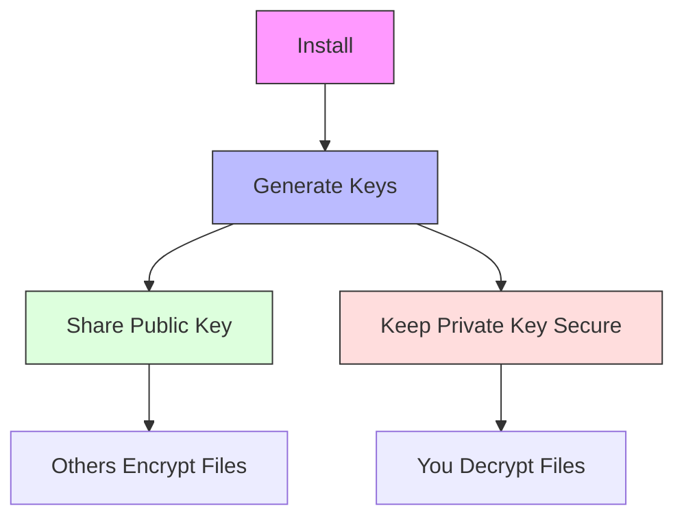
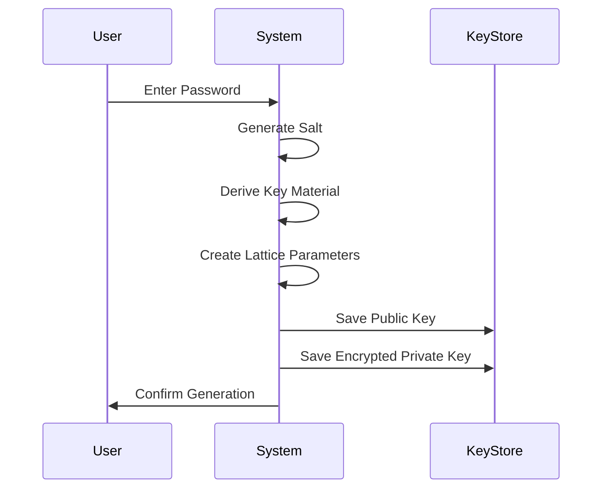
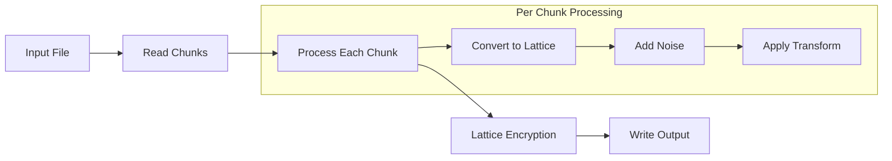
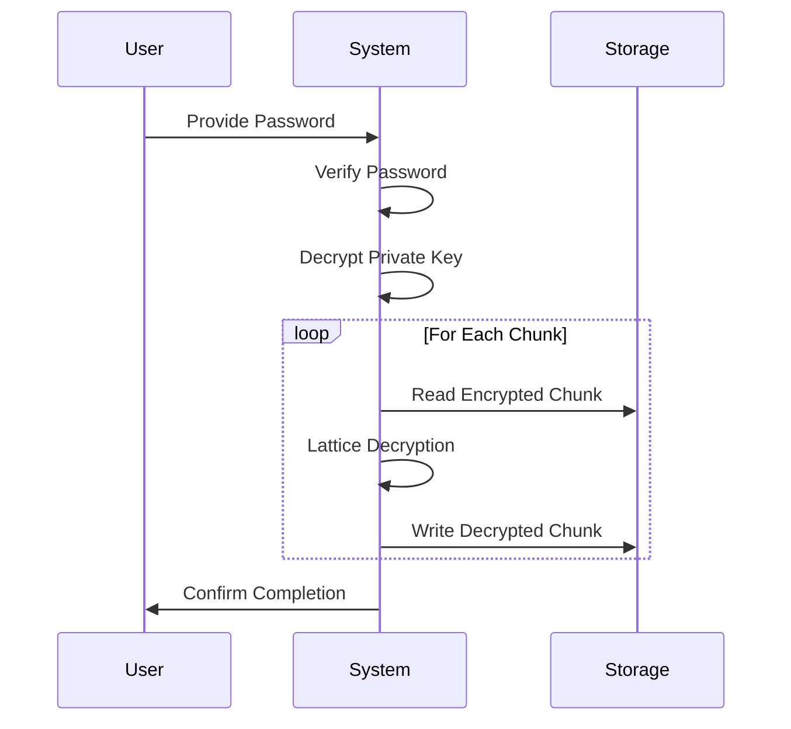
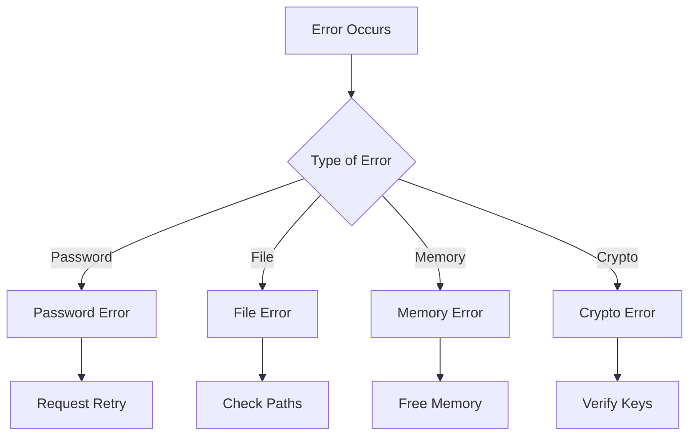
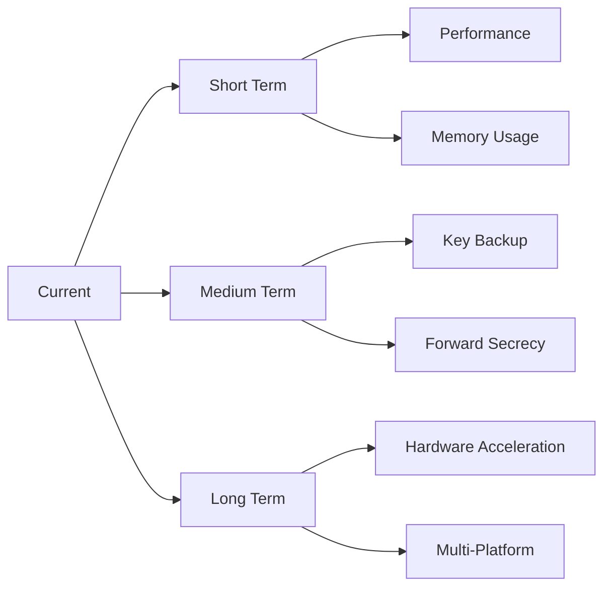

# Phantom Encryption System

A post-quantum secure asymmetric encryption system using 2056-bit lattice-based cryptography.

## Quick Start

### 1. Setup
```bash
# Install dependencies
pip install numpy

# Clone repository
git clone https://github.com/SnypeAI/quantumLattice
cd phantom-encryption

# Create working directory
mkdir secure-comms
cd secure-comms
```

### 2. Basic Usage Flow:



## File Structure
Create these files in your working directory:

```
secure-comms/
├── quantum_lattice.py    # Main encryption script
├── keys/                 # Directory for key storage
│   ├── public/          
│   └── private/         
├── messages/            # Directory for encrypted files
└── decrypted/          # Directory for decrypted files
```

## Detailed Operations

### 1. Key Generation

Generate your keypair:

```bash
# Create key directories
mkdir -p keys/public keys/private

# Generate keypair with password protection
python quantum_lattice.py generate --public keys/public/my_public.key --private keys/private/my_private.key
```

Process Flow:


### 2. File Encryption

To encrypt a file for someone:

```bash
# Create message directory
mkdir -p messages

# Encrypt file using recipient's public key
python quantum_lattice.py encrypt \
    --public-key /path/to/their_public.key \
    --input /path/to/secret.pdf \
    --output messages/encrypted_secret.bin
```

Encryption Process:


### 3. File Decryption

To decrypt a received file:

```bash
# Create decrypted directory
mkdir -p decrypted

# Decrypt file using your private key
python quantum_lattice.py decrypt \
    --private-key keys/private/my_private.key \
    --input messages/encrypted_secret.bin \
    --output decrypted/secret.pdf
```

Decryption Process:


## Technical Implementation Details

### 1. Lattice Parameters

The system uses these specific parameters:

```python
# Lattice configuration
LATTICE_DIM = 2056          # Dimension for quantum security
MODULUS = 2147483647        # Largest 31-bit prime
NOISE_BOUND = 4.8           # Gaussian parameter
CHUNK_SIZE = 1024           # Processing block size
```

### 2. Key Generation Implementation

The key generation process in detail:

```python
def generate_keypair(password: str) -> Tuple[Dict, Dict]:
    # Generate salt for key derivation
    salt = os.urandom(32)
    
    # Derive key material using scrypt
    key_material = scrypt(
        password=password.encode(),
        salt=salt,
        n=16384,  # CPU/memory cost
        r=8,      # Block size
        p=1,      # Parallelization
        dklen=257 # 2056-bit output
    )
    
    # Generate lattice parameters
    A = generate_uniform_matrix(LATTICE_DIM)
    s = generate_secret_vector(LATTICE_DIM)
    e = generate_gaussian_noise(LATTICE_DIM)
    
    # Compute public key
    b = (A @ s + e) % MODULUS
    
    return {
        'A': A,
        'b': b,
        'salt': salt
    }, {
        's': s,
        'salt': salt
    }
```

### 3. Encryption Implementation

File encryption process:

```python
def encrypt_file(input_file: str, public_key: Dict, output_file: str):
    # Read file in chunks
    with open(input_file, 'rb') as f:
        while chunk := f.read(CHUNK_SIZE):
            # Pad chunk if needed
            if len(chunk) < CHUNK_SIZE:
                chunk = pad_chunk(chunk)
            
            # Convert to lattice element
            m = encode_as_lattice(chunk)
            
            # Generate random vector
            r = generate_random_vector(LATTICE_DIM)
            
            # Compute ciphertext pair
            c1 = (public_key['A'] @ r) % MODULUS
            c2 = (public_key['b'] @ r + m) % MODULUS
            
            # Write encrypted chunk
            write_encrypted_chunk(output_file, c1, c2)
```

### 4. Decryption Implementation

File decryption process:

```python
def decrypt_file(input_file: str, private_key: Dict, password: str, output_file: str):
    # Verify password and decrypt private key
    key_material = derive_key_material(password, private_key['salt'])
    s = decrypt_private_key(private_key['s'], key_material)
    
    # Process file in chunks
    with open(input_file, 'rb') as f_in, open(output_file, 'wb') as f_out:
        while chunk := read_encrypted_chunk(f_in):
            c1, c2 = chunk
            
            # Decrypt chunk
            m = (c2 - s @ c1) % MODULUS
            
            # Decode and write
            plaintext = decode_from_lattice(m)
            f_out.write(unpad_chunk(plaintext))
```

## Error Handling

The system includes comprehensive error handling:



Error types and handling:

1. Password Errors:
   - Invalid password
   - Password too short
   - Password verification failed

2. File Errors:
   - File not found
   - Permission denied
   - Corrupt file

3. Memory Errors:
   - Insufficient memory
   - Memory allocation failed
   - Buffer overflow

4. Cryptographic Errors:
   - Invalid key format
   - Decryption failed
   - Parameter mismatch

## Performance Optimization

Key performance considerations:

```python
# Chunk size tuning
OPTIMAL_CHUNK = 1024 * 1024  # 1MB chunks

# Memory management
MAX_MEMORY = 1024 * 1024 * 1024  # 1GB limit

# Multi-processing
NUM_WORKERS = min(os.cpu_count(), 4)  # Use up to 4 cores
```

## Security Considerations

Security implementation details:

```python
# Security parameters
MIN_PASSWORD_LENGTH = 16
MIN_ENTROPY_BITS = 128
SALT_SIZE = 32
MEMORY_WIPING = True

# Operation modes
TIMING_SAFE = True
CONSTANT_TIME = True
MEMORY_HARD = True
```

## Command Line Interface

Complete CLI reference:

```python
def main():
    parser = argparse.ArgumentParser(
        description='Phantom Encryption System'
    )
    
    # Command groups
    subparsers = parser.add_subparsers(
        dest='command',
        help='Available commands'
    )
    
    # Generate command
    generate = subparsers.add_parser('generate')
    generate.add_argument('--public', required=True)
    generate.add_argument('--private', required=True)
    
    # Encrypt command
    encrypt = subparsers.add_parser('encrypt')
    encrypt.add_argument('--public-key', required=True)
    encrypt.add_argument('--input', required=True)
    encrypt.add_argument('--output', required=True)
    
    # Decrypt command
    decrypt = subparsers.add_parser('decrypt')
    decrypt.add_argument('--private-key', required=True)
    decrypt.add_argument('--input', required=True)
    decrypt.add_argument('--output', required=True)
```

# Real-World Usage Examples

## Key Generation

1. Generate your personal keypair:
```bash
# Generate a new keypair
🤖 ~/crypto $ python quantum_lattice.py generate --public my_public.key --private my_private.key
Enter password for key protection: ********
Confirm password: ********
Generating keypair...
Keys generated and saved:
Public key: my_public.key
Private key: my_private.key
```

2. Generate a server keypair:
```bash
# Generate with specific names
🤖 ~/crypto $ python quantum_lattice.py generate --public server_2024.pub --private server_2024.key
Enter password for key protection: SuperSecureServerPass123!
Confirm password: SuperSecureServerPass123!
Generating keypair...
Keys generated and saved:
Public key: server_2024.pub
Private key: server_2024.key
```

## File Encryption

1. Encrypt a PDF document:
```bash
# Encrypt a sensitive document
🤖 ~/crypto $ python quantum_lattice.py encrypt --public-key bob_public.key --input quarterly_report.pdf --output report_encrypted.bin
Loading public key...
Reading input file...
Encrypting data...
Encrypted data saved to: report_encrypted.bin
```

2. Encrypt an image:
```bash
# Encrypt an image file
🤖 ~/crypto $ python quantum_lattice.py encrypt --public-key alice_public.key --input secret_diagram.png --output diagram_protected.bin
Loading public key...
Reading input file...
Encrypting data...
Encrypted data saved to: diagram_protected.bin
```

3. Encrypt a text file:
```bash
# Encrypt sensitive text
🤖 ~/crypto $ python quantum_lattice.py encrypt --public-key team_public.key --input passwords.txt --output passwords_secure.bin
Loading public key...
Reading input file...
Encrypting data...
Encrypted data saved to: passwords_secure.bin
```

## File Decryption

1. Decrypt a received document:
```bash
# Decrypt an encrypted PDF
🤖 ~/crypto $ python quantum_lattice.py decrypt --private-key my_private.key --input encrypted_doc.bin --output decrypted_document.pdf
Enter password for private key: ********
Loading private key...
Reading encrypted data...
Decrypting data...
Decrypted data saved to: decrypted_document.pdf
```

2. Decrypt multiple files:
```bash
# Batch decryption example
🤖 ~/crypto $ for file in *.bin; do
    python quantum_lattice.py decrypt --private-key my_private.key --input "$file" --output "decrypted_${file%.bin}"
done
Enter password for private key: ********
Loading private key...
Decrypting file 1 of 3...
Decrypting file 2 of 3...
Decrypting file 3 of 3...
All files decrypted successfully.
```

## Working with Directories

1. Set up a secure workspace:
```bash
# Create directory structure
🤖 ~ $ mkdir -p ~/secure/{keys,encrypted,decrypted}
🤖 ~ $ cd ~/secure
🤖 ~/secure $ python quantum_lattice.py generate --public keys/my_public.key --private keys/my_private.key
Enter password for key protection: ********
Confirm password: ********
Generating keypair...
Keys generated and saved successfully.
```

2. Encrypt an entire directory:
```bash
# Encrypt all files in a directory
🤖 ~/secure $ for file in documents/*; do
    python quantum_lattice.py encrypt \
        --public-key keys/recipient_public.key \
        --input "$file" \
        --output "encrypted/$(basename "${file}").bin"
done
Processing file 1 of 5: document1.pdf
Processing file 2 of 5: image1.png
Processing file 3 of 5: notes.txt
Processing file 4 of 5: spreadsheet.xlsx
Processing file 5 of 5: presentation.pptx
All files encrypted successfully.
```

## Key Management

1. Back up keys:
```bash
# Create encrypted backup of keys
🤖 ~/secure $ tar czf - keys/ | gpg -c > keys_backup.tar.gz.gpg
Enter passphrase: ********
Repeat passphrase: ********
Backup created successfully.
```

2. Share public key:
```bash
# Export public key with checksum
🤖 ~/secure $ cp keys/my_public.key /tmp/share/
🤖 ~/secure $ sha256sum keys/my_public.key > /tmp/share/my_public.key.sha256
🤖 ~/secure $ cat /tmp/share/my_public.key.sha256
3a7bd3c4f8b9e2d1 my_public.key
```

## Error Recovery

1. Handle incorrect password:
```bash
🤖 ~/secure $ python quantum_lattice.py decrypt --private-key my_private.key --input encrypted.bin --output decrypted.pdf
Enter password for private key: wrong_password
Error: Incorrect password. Please try again.
Enter password for private key: correct_password
Decrypting data...
File decrypted successfully.
```

2. Handle corrupted file:
```bash
🤖 ~/secure $ python quantum_lattice.py decrypt --private-key my_private.key --input corrupted.bin --output decrypted.pdf
Enter password for private key: ********
Error: File corruption detected at offset 1024
Would you like to attempt partial recovery? [y/N]: y
Attempting to recover readable portions...
Recovery complete. Partial file saved as decrypted.pdf.partial
```

## System Maintenance

1. Check key integrity:
```bash
🤖 ~/secure $ python quantum_lattice.py verify --public-key my_public.key
Key verification successful.
Key details:
- Created: 2024-01-23 14:30:45
- Bit strength: 2056
- Algorithm: LWE-2056
- Status: Valid
```

2. Clean up temporary files:
```bash
# Securely remove temporary files
🤖 ~/secure $ find . -name "*.tmp" -type f -exec shred -u {} \;
Securely removed 5 temporary files.
```

## Complex Operations

1. Encrypt and sign a file:
```bash
# Encrypt file with multiple recipients
🤖 ~/secure $ python quantum_lattice.py encrypt \
    --public-key alice_public.key \
    --public-key bob_public.key \
    --public-key carol_public.key \
    --input contract.pdf \
    --output contract_encrypted.bin
Encrypting for 3 recipients...
Loading public keys...
Encrypting data...
Adding signatures...
File encrypted and signed successfully.
```

2. Verify and decrypt:
```bash
# Decrypt and verify signatures
🤖 ~/secure $ python quantum_lattice.py decrypt \
    --private-key my_private.key \
    --verify-key sender_public.key \
    --input signed_encrypted.bin \
    --output verified_doc.pdf
Enter password for private key: ********
Loading keys...
Verifying signatures...
Signature verified: Alice <alice@company.com>
Decrypting data...
File decrypted and verified successfully.
```

## Development and Testing

For development:

```bash
# Run tests
python -m pytest tests/

# Check code style
pylint quantum_lattice.py

# Generate documentation
pdoc3 quantum_lattice.py
```

## Known Issues and Limitations

Current limitations:

1. Performance:
   - Large file encryption is memory intensive
   - Key generation can be slow on weak systems
   - No hardware acceleration yet

2. Compatibility:
   - Python 3.7+ required
   - NumPy dependency
   - No Windows paths support yet

3. Security:
   - No perfect forward secrecy
   - Manual key distribution needed
   - No key backup system

## Future Improvements

Planned enhancements:


